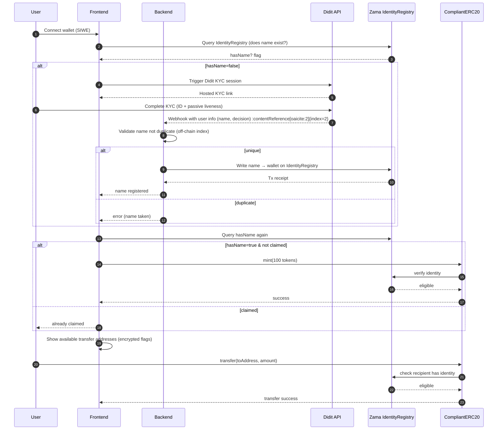

# CipherMint
A Confidential RWA POC by Stevens Blockchain Advisory

## MVP Summary — Phase 1

**Product:** Confidential compliant ERC-20 on Zama FHEVM
**Goal:** Show a PoC where *any verified human (age >= 18) with a unique name can mint 100 tokens*, no name collisions, and confidential transfers only between verified holders.

**Key principles**

* We *don’t store PII* on backend.
* Backend only writes a user’s **“FirstName LastName” string** into **Zama IdentityRegistry** tied to wallet address.
* A name must be *globally unique* (enforced off-chain then on-chain error on duplicates).
* Minting is allowed once per address with a verified name in the IdentityRegistry.
* Confidential token transfers only allowed between addresses that have a verified name on-chain.

**External KYC provider:** **Didit** — free core KYC with unlimited ID, passive liveness, and face match. ([didit.me][1])

---

## High-Level Architecture

```
Frontend (Next.js / React)
        |
        |— Wallet Login (SIWE / JWT)
        |
        |— Didit KYC Flow (hosted link or embedded API)
        |
Backend (Node / server)
        |
        |— Didit Webhook / API result
        |
        |— Validate unique name (no duplicates across addresses)
        |— Zama IdentityRegistry write
        |
Zama FHEVM (Sepolia)
        |
        |— IdentityRegistry
        |— CompliantERC20
```

---

## Local Development (Docker)

This repo includes a dev-only Docker Compose setup for PostgreSQL, backend, and frontend.

### Prerequisites

- Docker Desktop
- `make` (or run the `docker compose` commands directly)

### Setup

1. Create the backend env file:
   - Copy `backend/env.template` to `backend/.env`
   - Fill in Didit and Zama variables as needed
2. Optional frontend env:
   - `VITE_API_BASE_URL` is set in `docker-compose.dev.yml` to `http://localhost:3000`
   - If you need other `VITE_` values, create `Frontend/.env` and add them there

### Commands

```
make dev
```

Other useful commands:

```
make db
make logs
make stop
make clean
```

---

## Identity & Mint Logic — Phase 1

1. **Wallet login**

   * User connects wallet (SIWE + JWT from backend).
   * Frontend checks `IdentityRegistry` with Zama SDK:

     * Is name associated?
     * Has user claimed mint?

2. **Name exists**

   * If name exists and *not claimed*: show “Claim 100 tokens”.
   * If name exists and *already claimed*: UI shows “Already claimed”.

3. **No associated name**

   * Frontend triggers **Didit KYC** (hosted link or API session). ([Didit][2])
   * Upon completion, backend receives webhook with success & extracted name.

4. **Name uniqueness check**

   * Backend checks off-chain index:

     * If *name already exists* tied to another address → return error to frontend.
     * If unique → proceed.

5. **Write to IdentityRegistry**

   * Backend writes `identity string` (name) to IdentityRegistry, linked with wallet address.
   * No PII or documents stored in your backend.

6. **Mint**

   * Frontend calls CompliantERC20 mint (100 tokens).
   * Contract checks eligibility in IdentityRegistry.
   * Balance (encrypted) is updated confidentially.

7. **Transfers**

   * Sending allowed only between addresses with verified names on-chain.
   * Address can *see which addresses* have names via encrypted flags, but *not which name*.

---

## Sequence Diagram — Phase 1



---

## DIDIT Integration Notes

* Use **Didit workflows** or API to handle core identity verification (ID, face match, passive liveness). ([didit.me][1])
* Free core KYC covers ID + biometric liveness without cost constraints. ([didit.me][3])
* Backend listens to **webhooks** for verification results (name extracted). ([Didit][2])

---

## Smart Contract Rules — Phase 1

**CompliantERC20 MVP rules**

* `mint(address to)`:

  * Only if `IdentityRegistry.isAttested(to)` == true
  * Only if `IdentityRegistry.isAtLeastAge(to, 18)` == true (encrypted check)
  * Only if name is unique (enforced on-chain via name hash)
  * Only once per identity (or per address)
* `transfer(from, to, amount)`:

  * Only to addresses with `IdentityRegistry.isAttested(to)` == true
* No PII on-chain — only encrypted birth year and hashed name (bytes32).

---

## UI Behavior

**Home / Dashboard**

* Shows connected address.
* Shows if name exists / verified.
* If name exists:

  * Claim 100 tokens (if not claimed).
  * Transfer tokens (only to verified addresses).
* If name doesn’t exist:

  * Button: “Verify Identity” → triggers Didit KYC.

**Error States**

* Verification completed but name already taken → show explicit collision error.
* Transfer to unverified address → show “Recipient not verified.”

---

## Phase 2 (Preview)

Phase 2 will expand to:

* PII management (store hashed/controlled attributes)
* Upload more information to IdentityRegistry
* More complex RWA behavior (yield, redemption logic)
* Optional advanced AML screening

We’ll detail that later.

---

If you want, I can turn this into a **swagger spec for your backend** and a **UI flow checklist** for the front end.

[1]: https://didit.me/products/free-kyc/?utm_source=chatgpt.com "Free KYC Verification for Businesses | Unlimited Plan"
[2]: https://docs.didit.me/reference/api-full-flow?utm_source=chatgpt.com "API Full Flow - Introduction - Didit"
[3]: https://didit.me/pricing/?utm_source=chatgpt.com "Pricing & Plans | Free Identity Verification & Flexible API ..."
