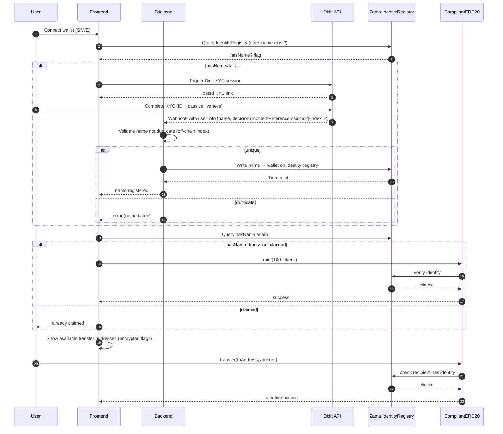

# CipherMint
A Confidential RWA POC by Stevens Blockchain Advisory

## MVP Summary — Current State

**Product:** Confidential compliant monetary stack on Zama fhEVM
**Goal:** Deliver a PoC with encrypted compliant transfers plus a monetary layer composed of:
- `SBA` (`CompliantUBI`) for compliant UBI issuance and policy operations.
- `CSBA` (`CipherCentralBank`) vault shares priced against SBA with monthly compounding and delayed exit.

**Key principles**

* We *don’t store PII* on backend.
* Backend only writes a user’s **“FirstName LastName” string** into **Zama IdentityRegistry** tied to wallet address.
* A name must be *globally unique* (enforced on-chain, not by the backend).
* Minting is allowed once per address with a verified name in the IdentityRegistry.
* Confidential token transfers only allowed between addresses that have a verified name on-chain.

**External KYC provider:** **Didit** — free core KYC with unlimited ID, passive liveness, and face match. ([didit.me][1])

---

## High-Level Architecture

```
Frontend (Next.js / React)
        |
        |— Wallet Login (SIWE / JWT)
        |
        |— Didit KYC Flow (hosted link or embedded API)
        |
Backend (Node / server)
        |
        |— Didit Webhook / API result
        |
        |— Validate unique name (no duplicates across addresses)
        |— Zama IdentityRegistry write
        |
Zama FHEVM (Sepolia)
        |
        |— IdentityRegistry
|— CompliantERC20
|— CompliantUBI (SBA)
|— CipherCentralBank (CSBA)
```

---

## Local Development (Docker)

This repo includes a dev-only Docker Compose setup for PostgreSQL, backend, and frontend.

### Prerequisites

- Docker Desktop
- `make` (or run the `docker compose` commands directly)

### Setup

1. Create the backend env file:
   - Copy `backend/env.template` to `backend/.env`
   - Fill in Didit and Zama variables as needed
2. Optional frontend env:
   - `VITE_API_BASE_URL` is set in `docker-compose.dev.yml` to `http://localhost:3000`
   - If you need other `VITE_` values, create `Frontend/.env` and add them there

### Commands

```
make dev
```

Other useful commands:

```
make db
make logs
make stop
make clean
```

---

## Identity & Mint Logic — Phase 1

1. **Wallet login**

   * User connects wallet (SIWE + JWT from backend).
   * Frontend checks `IdentityRegistry` with Zama SDK:

     * Is name associated?
     * Has user claimed mint?

2. **Name exists**

   * If name exists and *not claimed*: show “Claim 100 tokens”.
   * If name exists and *already claimed*: UI shows “Already claimed”.

3. **No associated name**

   * Frontend triggers **Didit KYC** (hosted link or API session). ([Didit][2])
   * Upon completion, backend receives webhook with success & extracted name.

4. **Write to IdentityRegistry**

   * Backend writes `identity string` (name) to IdentityRegistry, linked with wallet address.
   * No PII or documents stored in your backend.

5. **Mint**

   * Frontend calls CompliantERC20 mint (100 tokens).
   * Contract checks eligibility in IdentityRegistry.
   * Balance (encrypted) is updated confidentially.

6. **Transfers**

   * Sending allowed only between addresses with verified names on-chain.
   * Address can *see which addresses* have names via encrypted flags, but *not which name*.

---

## Sequence Diagram — Phase 1


```mermaid
sequenceDiagram
    autonumber
    participant U as User
    participant FE as Frontend
    participant BE as Backend
    participant DID as Didit API
    participant IR as Zama IdentityRegistry
    participant T as CompliantERC20

    U->>FE: Connect wallet (SIWE)
    FE->>IR: Query IdentityRegistry (does name exist?)
    IR-->>FE: hasName? flag

    alt hasName=false
        FE->>DID: Trigger Didit KYC session
        DID-->>FE: Hosted KYC link
        U->>DID: Complete KYC (ID + passive liveness)
        DID-->>BE: Webhook with user info (name, decision) :contentReference[oaicite:2]{index=2}
        BE->>BE: Validate name not duplicate (off-chain index)
        alt unique
            BE->>IR: Write name → wallet on IdentityRegistry
            IR-->>BE: Tx receipt
            BE-->>FE: name registered
        else duplicate
            BE-->>FE: error (name taken)
        end
    end

    FE->>IR: Query hasName again
    alt hasName=true & not claimed
        FE->>T: mint(100 tokens)
        T->>IR: verify identity
        IR-->>T: eligible
        T-->>FE: success
    else claimed
        FE-->>U: already claimed
    end

    FE->>FE: Show available transfer addresses (encrypted flags)
    U->>T: transfer(toAddress, amount)
    T->>IR: check recipient has identity
    IR-->>T: eligible
    T-->>FE: transfer success
```

---

## DIDIT Integration Notes

* Use **Didit workflows** or API to handle core identity verification (ID, face match, passive liveness). ([didit.me][1])
* Free core KYC covers ID + biometric liveness without cost constraints. ([didit.me][3])
* Backend listens to **webhooks** for verification results (name extracted). ([Didit][2])

---

## Smart Contract Rules — Implemented

**CompliantERC20 (base primitive)**

* Encrypted balances, allowances, and total supply (`euint64`).
* Branch-free transfer behavior: failed compliance or insufficient balance resolves to transfer amount `0` (no revert leak), while still emitting `Transfer`.
* Optional compliance checker integration and two-step ownership (`Ownable2Step`).

**CompliantUBI (`SBA`)**

* One-time claim: `100 SBA` for compliant users via encrypted checks.
* Recurring UBI: per-block linear accrual targeting `10 SBA/month`, claimable via `claimMonthlyIncome`.
* Monetary controller model:
  * `mint(to, amount)` first sources liquidity from `centralBankController`, then mints shortfall.
  * `burn(from, amount)` transfers to `centralBankController` (policy sink/source model).

**CipherCentralBank (`CSBA`)**

* Deposit flow: users deposit encrypted SBA and receive CSBA shares based on `sharePriceScaled`.
* Yield model: `sharePriceScaled` compounds monthly according to `monthlyRateBps` (owner-configurable, capped at `10000` bps).
* Exit flow (2-step):
  * `requestWithdraw` locks CSBA for one full `BLOCKS_PER_MONTH`.
  * `completeWithdraw` after unlock mints/pays SBA according to current share price.
* Bank inventory path (`address(this)`) bypasses compliance gating only for custody/re-issuance transfers; regular peer transfers remain compliance-gated.

---

## UI Behavior

**Home / Dashboard**

* Shows connected address.
* Shows if name exists / verified.
* If name exists:

  * Claim 100 tokens (if not claimed).
  * Transfer tokens (only to verified addresses).
* If name doesn’t exist:

  * Button: “Verify Identity” → triggers Didit KYC.

**Error States**

* Verification completed but name already taken → show explicit collision error.
* Transfer to unverified address → show “Recipient not verified.”

---

## Phase 2 (Preview)

Phase 2 will expand to:

* PII management (store hashed/controlled attributes)
* Upload more information to IdentityRegistry
* More complex RWA behavior (yield, redemption logic)
* Optional advanced AML screening

We’ll detail that later.

---

If you want, I can turn this into a **swagger spec for your backend** and a **UI flow checklist** for the front end.

[1]: https://didit.me/products/free-kyc/?utm_source=chatgpt.com "Free KYC Verification for Businesses | Unlimited Plan"
[2]: https://docs.didit.me/reference/api-full-flow?utm_source=chatgpt.com "API Full Flow - Introduction - Didit"
[3]: https://didit.me/pricing/?utm_source=chatgpt.com "Pricing & Plans | Free Identity Verification & Flexible API ..."
